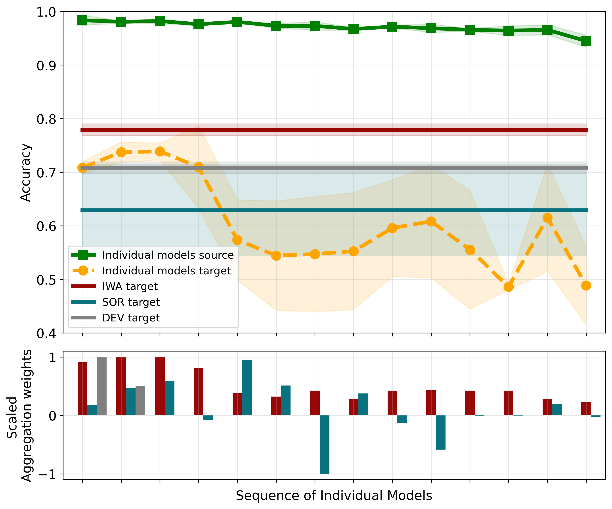
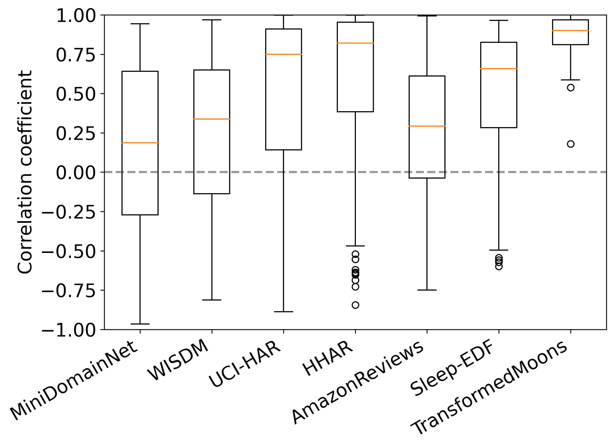
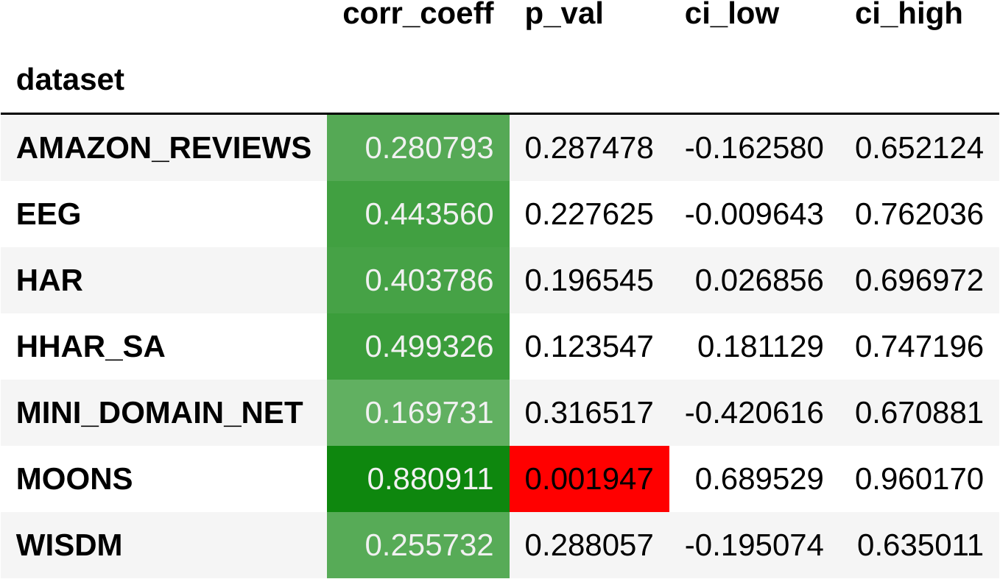

# staz - Statistical Analyses for Experiment Results
This repo serves as a collection of code snippets for statistical analysis of experiment results.
Different analysis are organized in separate folders and there is no dependence between them. 
Therefore snippets are meant as a reference for quick re-implementation and usage in other projects.

So far it comprises the following analyses:
- [Correlation analysis](correlation_analysis)

## Correlation analysis
This analysis was performed for our publication XXX.

In this paper we added this plot showing results of a single experiment to demonstrate the performance of our method:
<!--  -->

This plot already indicates a positive correlation between the aggregation weights (red bars, bottom) in the aggregation computed by IWA (the method proposed in the paper) and the target accuracy of the individual models (orange line, top). 

With this analysis we want to demonstrate, that this is not only the case for this single experiment, but a general trend of our method. Therefore, we expect a clear tendency to a positive correlation between the aggregation weights and target performance. 
Code and results of this study can be found in the [this notebook](./correlation_analysis/corr_analysis_da_aggregation.ipynb).

### Correlation analysis results
Here are the correlation results for IWA (our method) (Table shows mean values over all datasets, interpret with care):

We see a tendency for a positive correlation.